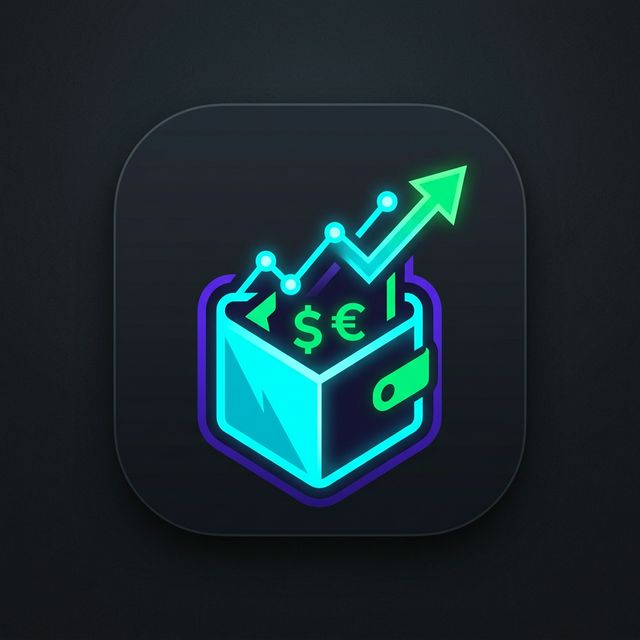
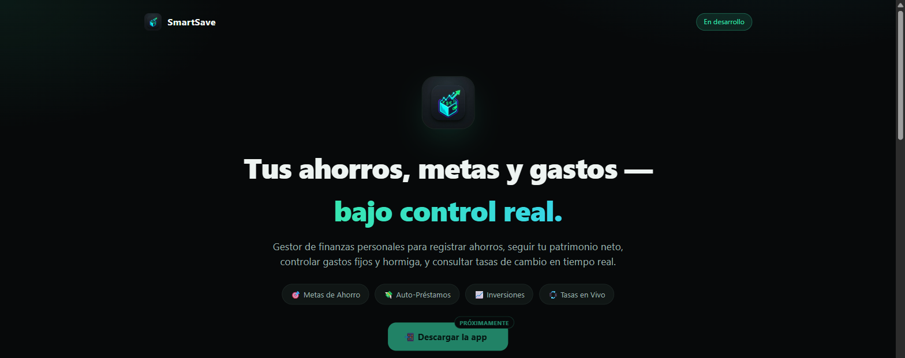
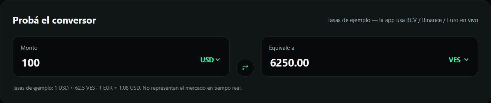
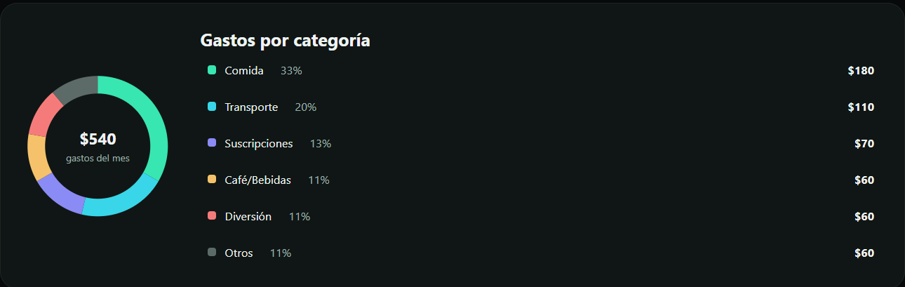
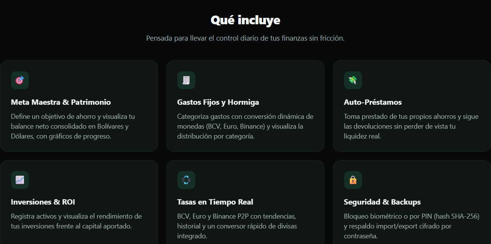

  

<h1 align="center">SmartSave</h1>

  Gestor de finanzas personales: metas de ahorro, patrimonio neto, gastos fijos y hormiga, 
  auto-préstamos y tasas de cambio en tiempo real (BCV, Binance, Euro).

  <a href="https://smartsave-landing.vercel.app">🔗 Ver landing / demo interactivo</a>

> 🔒 **El código fuente de este proyecto es privado.** Este repositorio es una vista general (arquitectura, features, capturas) para portafolio. Código disponible bajo solicitud en una entrevista.

---

## Capturas reales

   
  
   
  

## Qué hace

- **Meta Maestra & Patrimonio**: objetivo de ahorro y balance neto consolidado en Bolívares y Dólares, con gráficos de progreso.
- **Gastos Fijos y Hormiga**: categorización con conversión dinámica de moneda (BCV, Euro, Binance) y distribución por categoría.
- **Auto-Préstamos**: pide prestado de tus propios ahorros y sigue las devoluciones sin perder de vista tu liquidez real.
- **Inversiones & ROI**: registro de activos y rendimiento frente al capital aportado.
- **Tasas en tiempo real**: BCV, Euro y Binance P2P con tendencias, historial y conversor rápido integrado.
- **Seguridad & Backups**: bloqueo biométrico o por PIN (hash SHA-256), respaldo import/export cifrado por contraseña.

## Arquitectura

100% local — sin backend propio. Todos los datos viven en el dispositivo del usuario.

- **App**: Flutter, persistencia con `SharedPreferences`.
- **Tareas en segundo plano**: `Workmanager` para actualizar tasas de cambio periódicamente.
- **Seguridad**: `local_auth` (biometría/PIN), hash SHA-256.
- **Estado**: `Provider`.

## Stack técnico

`Flutter` · `Dart` · `Provider` · `Workmanager` · `SharedPreferences` · `local_auth`

---

Desarrollado por <a href="https://www.linkedin.com/in/airan-bracamonte">Airan Bracamonte</a>

